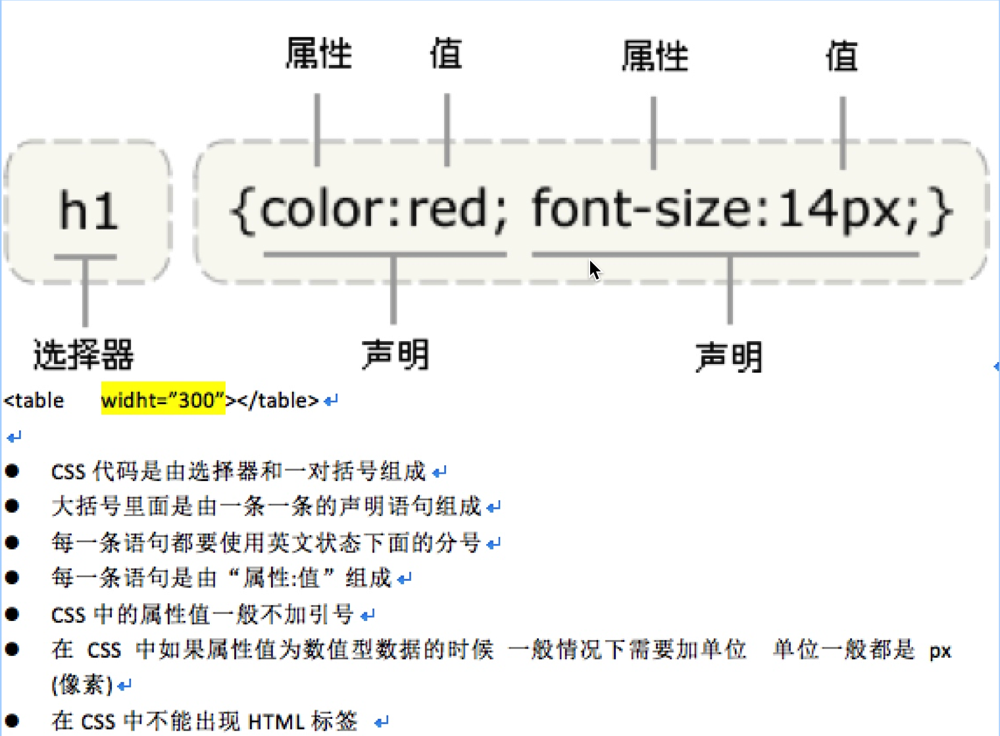
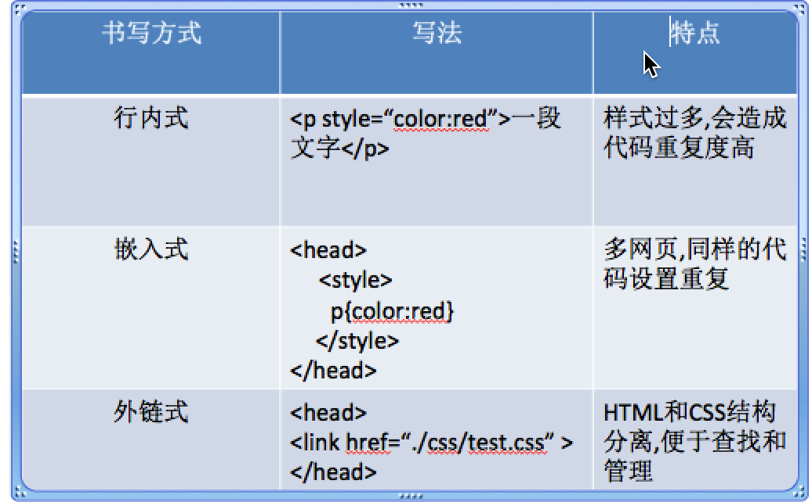

## CSS基本语法
```
CSS的定义方法是
选择器 { 属性：值； 属性：值； 属性：值；}
```

## CSS的3种书写方式:

#### 1.行内式(内联式):
```html
1. 将CSS代码书写在HTML标签的style__属性中;style是一个通用属性，每一个标签里面都拥有这个属性！
2. <div style="width:100px; height:100px; background:red ">......</div>
```

#### 2.嵌入式:
```html
 将CSS代码嵌入到HTML文件中，嵌入式是通过HTML中的_style标签_将CSS代码嵌入到HTML网页中！
<style type="text/css">
    div{ width:100px; height:100px; background:red }
    ......
</style>
```
#### 3.外链式:
```html
外链式是指单独写一个以.css为扩展名的文件，然后在head标签中使用link标签，将这个css文件链接到html文件中
注意：css文件不能单独的运行，它必须要依赖于HTML文件！
```

